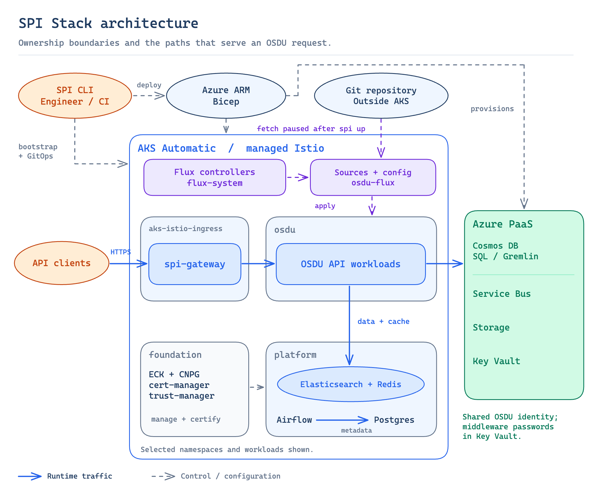

# Architecture

> This document is the 30,000-ft overview of SPI Stack. For deeper explainers of
> specific subsystems (deployment lifecycle, Bicep, Flux reconciliation, Workload
> Identity, ingress, secret lifecycle), see [`docs/design/`](design/). Each design
> doc links back to the relevant ADRs.

## Overview

SPI Stack deploys the OSDU platform on Azure with a hybrid provisioning model: Bicep declares every Azure resource, the `spi` CLI orchestrates the seams Bicep cannot cover (resource group creation, soft-delete Key Vault recovery, K8s bootstrap, Istio CNI chaining), and Flux CD continuously reconciles everything inside the cluster. Unlike a cloud-agnostic stack where all middleware runs in-cluster, SPI Stack offloads data services to Azure PaaS (Cosmos DB, Service Bus, Storage, Key Vault, Entra ID) and keeps in-cluster workloads only where no managed equivalent exists.

### How the system works

SPI Stack has three control planes working together:

1. **The `spi` CLI** bootstraps the environment. It creates the resource group, submits Bicep deployments for the cluster (`infra/aks.bicep`) and the rest of the Azure PaaS surface (`infra/main.bicep`), bootstraps the cluster (namespaces, StorageClasses, ServiceAccount, `osdu-config` ConfigMap), submits a third Bicep deployment (`infra/flux.bicep`) that activates the AKS Flux extension, then writes a small set of runtime Key Vault secrets: seed passwords, fixed in-cluster hostnames, and the Table storage endpoint.
2. **Flux CD** manages desired-state reconciliation. It watches this Git repository and the OCI chart registry, and continuously converges the cluster to match.
3. **Kubernetes operators** (ECK, CNPG, cert-manager, trust-manager) manage the lifecycle of individual middleware systems beneath the Flux layer.

The CLI does the minimum work needed to get Azure resources provisioned and Flux running. After that, Flux owns everything inside the cluster.

> **Dev/test posture.** The CLI and defaults are tuned for Azure dev/test environments: generated shared credentials for in-cluster middleware, Let's Encrypt or self-signed certificates depending on ingress mode, and optional live credential display. The stack is quick to spin up and inspect; it is not a hardened production operating model.

## System Architecture



Clients connect through the AKS managed Istio gateway. OSDU services run in the cluster with Workload Identity and reach Azure PaaS (Cosmos DB, Service Bus, Storage, Key Vault) outside the cluster boundary. Flux CD reconciles all in-cluster state from this Git repository.

## GitOps + Bootstrap Boundary

This project uses a **GitOps + bootstrap** model (see [ADR-008](decisions/008-bicep-for-azure-provisioning.md) and [ADR-009](decisions/009-flux-cd-for-gitops.md)):

1. The CLI performs Azure-specific bootstrap work.
   - Provision the AKS cluster and all Azure PaaS resources via Bicep.
   - Bootstrap the cluster with namespaces, StorageClasses, ServiceAccount, and the `osdu-config` ConfigMap.
   - Activate the AKS Flux extension (also declared in Bicep).
   - Write runtime Key Vault secrets (seed passwords, fixed in-cluster hostnames, the Table storage endpoint) without waiting for middleware.
2. Flux then owns steady-state reconciliation for everything else.

This keeps the in-cluster graph clean, while accepting that Azure infrastructure must land imperatively before Flux can start.

## Deployment Pipeline


The deployment pipeline has two phases: the CLI's Bicep-driven bootstrap (top) and Flux's layered reconciliation plus the schema-load one-shot (bottom). The dashed line marks the handoff point.

### CLI phases

| Phase | Mechanism | What |
|-------|-----------|------|
| 1. Resource Group | `az group create` | Resource group for the environment |
| 2. AKS + managed Istio | Bicep (`infra/aks.bicep`) | AKS Automatic cluster, BYO VNet + NAT gateway, managed Istio |
| 3. Azure PaaS | Bicep (`infra/main.bicep`) | Managed Identity + federated credentials, Key Vault + static metadata secrets, ACR, Cosmos DB Gremlin + per-partition SQL, per-partition Service Bus (topics + subscriptions), common + per-partition Storage, RBAC role assignments |
| 4. K8s bootstrap | `kubectl apply` | Namespaces, StorageClasses, `workload-identity-sa`, `osdu-config` ConfigMap, `spi-ingress-config` ConfigMap |
| 5. Flux activation | Bicep (`infra/flux.bicep`) | AKS Flux extension + `fluxConfigurations` with two Kustomizations (stack profile, ingress mode) |
| 6. Runtime KV secrets | `az keyvault secret set` | Per-partition Elasticsearch credentials, Redis hostname and password, and `tbl-storage-endpoint`: seed passwords, fixed in-cluster hostnames, and the common Storage account name (no wait for middleware) |

A full `spi up` typically takes ~45-50 minutes, dominated by AKS Automatic provisioning (~30 min) with PaaS Bicep (~3 min), K8s bootstrap (~1 min), and the Flux extension Bicep (~10-15 min) filling the remainder. `spi up --dry-run` runs `az deployment group what-if` against both Bicep templates and skips everything after phase 1.

## Runtime Architecture

### Namespace model

Three application namespaces:

| Namespace | Purpose | Istio injection | Contents |
|-----------|---------|-----------------|----------|
| **foundation** | Cluster operators | No | ECK, CNPG, cert-manager, trust-manager |
| **platform** | Middleware and TLS certificates | No | Elasticsearch, Redis, PostgreSQL (Airflow), Airflow, cert-manager Certificates |
| **osdu** | OSDU services | Yes | OSDU service deployments, schema-load Job, `osdu-config`, `workload-identity-sa` |

The `flux-system` namespace is managed by the AKS Flux extension and hosts the Flux controllers. SPI-owned GitOps objects (the `GitRepository`, Kustomizations, and bootstrap ConfigMaps/Secrets) live in the dedicated `osdu-flux` namespace (see [ADR-019](decisions/019-osdu-flux-gitops-namespace.md)). `aks-istio-system` and `aks-istio-ingress` are owned by AKS; the `spi-gateway` Gateway lives in `aks-istio-ingress`, bound to the managed ingress ([ADR-026](decisions/026-bind-managed-istio-ingress.md)). See [ADR-006](decisions/006-three-namespace-model.md).

### Layered dependency model

The core profile (`software/stacks/osdu/profiles/core/stack.yaml`) defines seven major dependency layers (numbered 0-6) plus per-partition and schema-load one-shot Jobs. Sub-letter groupings (`0a`/`0b`, `4a`/`4b`) reconcile in parallel within their parent layer.

| Layer | Name | Depends on |
|-------|------|------------|
| 0a | Namespaces | none |
| 0b | Karpenter NodePools | 0a |
| 1 | Operators (ECK, CNPG), cert-manager, trust-manager, shared Helm sources | 0a (trust-manager on cert-manager) |
| 2 | Middleware (Elasticsearch, Redis, PostgreSQL) | 1 + 0b |
| 3 | Airflow | 2 (PostgreSQL) |
| 4a | OSDU configuration placeholder | 0a |
| 4b | Bootstrap (trust-manager Bundles + Redis DestinationRule) | trust-manager, ES, Redis, 4a |
| 5 | Core OSDU services | 4b + 0b |
| 5a | Partition + entitlements bootstrap (per-partition Jobs) | 5 |
| 5b | Schema load (one-shot Job) | 5a |
| 5c | Legal tag seeding (per-partition Jobs, non-gating) | 5a |
| 6 | Reference services | 5, 5b |

The ingress profile (`software/stacks/osdu/ingress/<mode>/`) adds Kustomizations at Layer 1 (cert issuers, ExternalDNS in `dns` mode, and the `spi-gateway-tls` overlay that owns the Gateway) and Layer 6 (HTTPRoutes, split into `spi-middleware-routes` and `spi-osdu-routes`). See [ADR-007](decisions/007-layered-kustomization-ordering.md) and [ADR-012](decisions/012-ingress-profiles.md).

### Stack profiles

`spi up --profile <name>` selects which slice of the layer DAG Flux reconciles.

| Profile | Layers | Deploys |
|---------|--------|---------|
| `minimal` | 0a-4b | Middleware only: operators, cert-manager, trust-manager, Gateway, Elasticsearch, Redis, PostgreSQL, Airflow, CA bundles. No OSDU services. |
| `core` (default) | 0a-6 | Everything in `minimal`, plus the OSDU services, partition/entitlements bootstrap, schema load, and reference services. |
| `bare` | none | Nothing. Infra plus activated GitOps only; Flux reconciles empty stack and ingress trees. |

Layers 0a through 4b are byte-identical between the `minimal` and `core` profiles, so middleware validated under `minimal` behaves the same under `core`. Because `minimal` never creates `spi-osdu-services`, it pairs with the `<mode>-minimal` ingress trees, which omit the OSDU HTTPRoute Kustomization that would otherwise stall on that dependency. See [ADR-021](decisions/021-middleware-only-minimal-profile.md).

## AKS Automatic

SPI Stack uses AKS Automatic, which provides:

| Feature | What it does |
|---------|-------------|
| **Karpenter** | Node Auto-Provisioning; user-declared NodePool CRs at Layer 0b |
| **Managed Istio** | Service mesh with mTLS, sidecar injection, ingress gateway |
| **Deployment Safeguards** | Non-bypassable admission policies (non-root, seccomp, capability drop, probes, resource limits) |
| **Key Vault CSI** | Secrets Provider driver available to workloads |
| **Cilium CNI** | eBPF networking in overlay mode |
| **Managed Prometheus** | Metrics to Azure Monitor |
| **Container Insights** | Logs to Log Analytics |

Safeguards are non-bypassable, so every pod must comply:

- `securityContext.runAsNonRoot: true`
- `securityContext.seccompProfile.type: RuntimeDefault`
- `securityContext.capabilities.drop: [ALL]`
- `securityContext.allowPrivilegeEscalation: false`
- Resource requests and limits defined
- Liveness and readiness probes defined

The local `osdu-spi-service` Helm chart bakes these into its templates so services comply at authoring time. See [ADR-002](decisions/002-aks-automatic.md) and [ADR-004](decisions/004-local-helm-chart-safeguards.md).

## Ingress Profiles

`spi up --ingress-mode <mode>` selects one of three profiles. The mode is plumbed into `infra/flux.bicep` as the `ingress` Kustomization path and into the `spi-ingress-config` ConfigMap consumed by Flux `postBuild` substitutions.

| Mode | Hostname source | TLS | DNS management | Use case |
|------|-----------------|-----|----------------|----------|
| `azure` (default) | Azure-assigned `<label>.<region>.cloudapp.azure.com` | Let's Encrypt HTTP-01 (single host) | none | Dev spin-up; zero config |
| `dns` | `*.<user-zone>` (osdu, kibana, airflow) | Let's Encrypt HTTP-01 (multi-host) | ExternalDNS to Azure DNS Zone | Team environments |
| `ip` | bare ingress IP, no hostname | none | none | Smoke tests and debug |

See [ADR-012](decisions/012-ingress-profiles.md).

## Service Catalog


The diagram shows simplified service-to-service dependencies for the core OSDU APIs. Shared middleware dependencies (Elasticsearch, Redis) are omitted for clarity.

### Core services (Layer 5)

| Service | Azure PaaS dependencies | In-cluster dependencies |
|---------|-------------------------|-------------------------|
| partition | Redis | none |
| entitlements | Cosmos DB Gremlin, Redis | none |
| legal | Cosmos DB SQL, Service Bus, Storage | Redis |
| schema | Cosmos DB SQL, Service Bus, Storage | none |
| storage | Cosmos DB SQL, Service Bus, Storage | Redis |
| search | Cosmos DB SQL | Elasticsearch, Redis |
| indexer | Cosmos DB SQL, Service Bus | Elasticsearch, Redis |
| indexer-queue | Service Bus | none |
| file | Cosmos DB SQL, Storage | Redis |
| workflow | Cosmos DB SQL, Storage | Airflow |

### Reference services (Layer 6)

| Service | Notes |
|---------|-------|
| unit | Unit conversion; standalone |
| crs-conversion | CRS transformation; downloads SIS data in an init container |
| crs-catalog | CRS reference catalog; standalone |

All services use OCI Helm charts pinned to full Git SHAs, rendered through the local `osdu-spi-service` chart (ADR-004).

## Data Flow

```
                         Azure Entra ID
                              |
                         JWT Token
                              |
                              v
Client --> Istio Gateway --> OSDU Service --+--> Cosmos DB (read/write records)
                                            +--> Service Bus (publish events)
                                            +--> Azure Storage (blob/table ops)
                                            +--> Key Vault (fetch secrets)
                                            +--> Elasticsearch (search/index)
                                            +--> Redis (cache)
                                                      |
                              +-----------------------+
                              v
              indexer-queue (Service Bus consumer)
                              |
                              v
                    indexer (Elasticsearch writer)
```

## Identity and Access

A single User-Assigned Managed Identity (`<cluster>-osdu-identity`) is shared by all OSDU services. A federated credential binds it to the `workload-identity-sa` ServiceAccount in the `osdu` namespace. Pods with the `azure.workload.identity/use: "true"` label get projected tokens and exchange them for Entra ID access tokens at runtime.

| Component | Detail |
|-----------|--------|
| Identity | User-Assigned Managed Identity (`<cluster>-osdu-identity`) |
| ServiceAccount | `workload-identity-sa` in `osdu` |
| Token path | `/var/run/secrets/azure/tokens/token` |
| Exchange | Entra ID token exchange via AKS OIDC issuer |

### RBAC roles assigned

| Role | Scope | Purpose |
|------|-------|---------|
| Key Vault Secrets User | Vault | Read secrets |
| Storage Blob Data Contributor | Common + per-partition accounts | Blob operations |
| Storage Table Data Contributor | Common account | Table operations |
| Service Bus Data Sender | Per-partition namespace | Publish events |
| Service Bus Data Receiver | Per-partition namespace | Consume events |
| Cosmos DB Built-in Data Contributor | Per-partition SQL account, Gremlin account | Cosmos data-plane RBAC |
| AcrPull | ACR | Pull container images |

A second UAMI (`<cluster>-external-dns`, scoped `DNS Zone Contributor` on the zone's resource group) is provisioned conditionally when the ingress mode is `dns`. See [ADR-005](decisions/005-workload-identity.md) and [ADR-012](decisions/012-ingress-profiles.md).

## Reconciliation Lifecycle

Two reconciliation loops keep the cluster converged.

### Infrastructure loop

Changes to this repository (middleware manifests, profile definitions, service YAML) flow through the `GitRepository` source. Flux polls the remote, detects new commits, and reconciles the `stack` and `ingress` Kustomizations in dependency order.

### Service update loop

When an OSDU service merges to its main branch, CI builds a new container image and the canonical registry exposes a new immutable tag: community GitLab by default, or the fork's GHCR `main` line once the service is onboarded ([ADR-033](decisions/033-canonical-image-source-follows-onboarding.md)). The first `spi up` resolves the current tags and writes them to `osdu-flux/osdu-image-lock`; a re-run preserves an existing lock unless `--refresh-images` re-resolves it ([ADR-017](decisions/017-osdu-image-lock.md)). An explicit `--no-refresh-images` fails closed if a core deployment has no lock yet. The service Kustomizations consume that ConfigMap through Flux post-build substitution. This keeps the deployed image set explicit while avoiding stale, pruned tags in long-lived test workflows.

Run `spi reconcile --refresh-images` to resolve a fresh image lock for an existing cluster, then reconcile the service Kustomizations and schema-load before reference services. Schema-load uses the same selected SHA as schema-service, with the loader repository checked for that exact tag. A plain `spi reconcile` leaves the pins alone, except that it backfills the schema-load entries into a lock generated before the loader joined it.

### Suspend and resume

`spi reconcile --suspend` patches `spec.suspend: true` on the `GitRepository`; Flux stops fetching new revisions. `spi reconcile` (no flag) triggers a one-shot reconcile. `spi reconcile --resume` unpins the source. `spi status` and `spi info` surface a suspend warning when the source is pinned.

### The shared backing environment

`spi-stack-shared` is an ordinary deployment of this same stack (`spi up --env shared --tag <vX.Y.Z>`), pinned to an immutable release tag rather than a branch, with its own resource-name suffix, deploy record, and `maintenance` flag (`src/spi/deploy_record.py`). Two GitHub Actions workflows own its lifecycle: `env-upgrade.yml` provisions it and moves it to a new `stackVersion` after a reviewed bump PR merges, and `env-refresh.yml` reconciles and probes it on a weekday schedule. Both read `ops/environments/shared.yaml`, a strictly typed declaration (`src/spi/environment.py`), install the exact release wheel that declaration names, and never mutate the environment without first setting `maintenance` and clearing it only after Flux readiness and gateway probes pass. See [environment-lifecycle.md](design/environment-lifecycle.md) for the full contract, including what this lifecycle does not yet do (reset, teardown, fork onboarding).

## Configuration and Secret Model

### osdu-config ConfigMap

Created by the CLI during K8s bootstrap and mounted into every OSDU service via `envFrom`:

| Key | Source |
|-----|--------|
| `DOMAIN` | Ingress hostname or IP (mode-dependent) |
| `PRIMARY_PARTITION` | Primary partition name |
| `AZURE_TENANT_ID` | Entra ID tenant |
| `AAD_CLIENT_ID` | Managed identity client ID |
| `KEYVAULT_URI`, `KEYVAULT_URL`, `KEYVAULT_NAME` | Key Vault URI and name |
| `PRIMARY_COSMOSDB_ENDPOINT`, `COSMOSDB_DATABASE` | Primary partition's Cosmos DB SQL endpoint and database (`osdu-db`) |
| `PRIMARY_STORAGE_ACCOUNT_NAME` | Common Storage account (not the partition's; the CLI fills it from `common_storage_name`) |
| `PRIMARY_SERVICEBUS_NAMESPACE` | Primary partition's Service Bus namespace |
| `REDIS_PORT`, `SERVER_PORT` | Fixed ports (6379, 8080) |
| `APPINSIGHTS_KEY` | Always empty; the CLI does not wire the provisioned connection string through (ADR-020) |
| `ELASTICSEARCH_HOST` | In-cluster Elasticsearch FQDN |

### Secret model

| Class | Store | Access path |
|-------|-------|-------------|
| Azure PaaS credentials | Entra ID | Workload Identity; no stored material |
| PaaS metadata and secret values | Azure Key Vault | SDK reads under Workload Identity (or CSI) |
| In-cluster middleware passwords | Kubernetes Secrets in `platform`/`osdu` | CLI-generated once per environment |

Most Key Vault secret values are declared in `infra/main.bicep` and resolved at deploy time. Local auth is disabled on the Cosmos and Service Bus accounts (ADR-023), so their key and connection secrets are written as `"DISABLED"` placeholders instead of real key material. A small set of runtime secrets are written post-handoff by the CLI: Elasticsearch and Redis credentials from the generated seed passwords and fixed in-cluster hostnames, and `tbl-storage-endpoint` derived from the common Storage account name. See [ADR-010](decisions/010-keyvault-secret-management.md).

### CA distribution and Redis mTLS

Redis and Elasticsearch TLS CAs live as Secrets in `platform`. trust-manager (in `foundation`) mirrors them into `osdu` via `Bundle` CRs (`software/stacks/osdu/bootstrap/ca-bundles.yaml`) so the `osdu-spi-service` chart's `import-ca-certs` init container can fold them into a Java truststore. A static Istio `DestinationRule` in the same Kustomization disables mTLS to the in-cluster Redis master to avoid TLS-in-TLS. See [ADR-011](decisions/011-trust-manager-ca-distribution.md).

## Azure PaaS Resource Summary

### Per environment (shared)

| Resource | Purpose | Sizing |
|----------|---------|--------|
| AKS Automatic | Compute | Karpenter-managed |
| Cosmos DB Gremlin | Entitlements graph | 4000 RU/s autoscale |
| Key Vault | Secret management | Standard, RBAC-enabled |
| ACR | Container images | Basic SKU |
| Managed Identity (`<cluster>-osdu-identity`) | Workload Identity | Single, shared |
| Managed Identity (`<cluster>-external-dns`) | DNS Zone Contributor | Conditional on `dns` ingress mode |

### Per partition

| Resource | Purpose | Sizing |
|----------|---------|--------|
| Cosmos DB SQL | Operational data | 4000 RU/s autoscale; `osdu-db` (24 containers), plus `osdu-system-db` (5 containers) on the primary partition only |
| Service Bus | Async messaging | Standard SKU, 14 topics, 14 subscriptions |
| Storage account | Blob and table storage | Standard LRS, 5 containers |

### In-cluster (per environment)

| Component | Instances | Storage | Purpose |
|-----------|-----------|---------|---------|
| Elasticsearch | 3 nodes | 128 GiB each | Search and indexing |
| Redis | 1 master + 2 replicas | 8 GiB each | Caching (TLS) |
| PostgreSQL | 3 instances (CNPG) | 10 GiB + 4 GiB WAL | Airflow metadata |
| Airflow | API server + Scheduler + DAG processor + Triggerer | n/a | Workflow orchestration |
