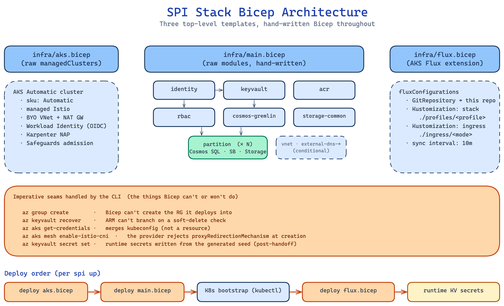

# Bicep architecture

Azure infrastructure is split across three resource-group-scoped templates.
The CLI supplies names and parameters, submits the deployments, and performs
the client-side and Kubernetes work between them.



## Template ownership

| Entrypoint | Owns | Needs before deployment |
|---|---|---|
| `infra/aks.bicep` | AKS Automatic, managed Istio configuration, VNet/subnets, NAT gateway, cluster control-plane identity and network role | Resource group |
| `infra/main.bicep` | OSDU and deploy identities, Key Vault metadata, ACR, Gremlin, common Storage, per-partition resources, RBAC; optional ExternalDNS and Application Insights | AKS OIDC issuer, kubelet identity, deployer principal |
| `infra/flux.bicep` | AKS Flux extension and Git configuration with `stack` and `ingress` Kustomizations | Cluster and Kubernetes bootstrap inputs |

The split follows deployment dependencies, not fixed duration targets. The AKS
deployment produces an OIDC issuer needed by the workload identities. Bootstrap
must create configuration and credential inputs before Flux starts workloads.
See [deployment timing](deployment-lifecycle.md#timing-and-readiness) for
provisioning estimates.

`aks.bicep` declares a raw `Microsoft.ContainerService/managedClusters`
resource with networking, identity, and managed Istio settings. PaaS resources
use local Bicep modules. [ADR-008](../decisions/008-bicep-for-azure-provisioning.md)
records the resource-provider and template boundaries.

## Modules and naming

| Module | Responsibility |
|---|---|
| `vnet.bicep` | VNet, private subnets, NAT gateway and public IP; called by `aks.bicep` in every ingress mode |
| `identity.bicep` | Shared OSDU identity and federated ServiceAccount bindings; environment deploy identity |
| `keyvault.bicep`, `acr.bicep` | Vault and registry resources |
| `cosmos-gremlin.bicep` | Shared entitlements graph and Cosmos-native data-plane role |
| `storage-common.bicep` | Shared blob/table Storage account |
| `partition.bicep` | One partition's Cosmos SQL data and role, Service Bus, Storage, metadata and `DISABLED` credential placeholders |
| `rbac.bicep` | Workload resource access, deployer Key Vault access, and kubelet image-pull access |
| `external-dns-identity.bicep`, `external-dns-role.bicep` | Conditional DNS identity and role in the DNS zone's resource group |

`main.bicep` loops over `dataPartitions` to deploy partition modules. It also
declares shared and per-partition Key Vault metadata values outside those
modules. Secret ownership is detailed in [secret lifecycle](secret-lifecycle.md).

The CLI derives resource names from `--env` and a suffix persisted on the
resource group. It passes explicit names to Bicep. Add naming logic in
`config.py` or `azure_infra.py` when introducing a resource rather than creating
a second, inconsistent naming rule in a template.

ExternalDNS resources are conditional on `dnsZoneName`; the VNet is not. The
cluster control-plane identity in `aks.bicep` is also separate from the OSDU
workload identity in `main.bicep`.

Cosmos and Service Bus set `disableLocalAuth: true`; Storage disables
shared-key access. No `listKeys()`-derived credentials are written. Cosmos SQL
and Gremlin grants are declared in their resource modules rather than
`rbac.bicep`, because they use Cosmos-native role assignments.

`enableApplicationInsights` in `main.bicep` defaults to `false` and gates both
Application Insights and Log Analytics. The template exposes their connection
string when enabled, but the CLI does not expose a corresponding option. See
[ADR-020](../decisions/020-optional-application-insights.md) for that boundary.

## Work that remains outside the templates

The CLI creates the target resource group because these templates deploy at
resource-group scope. Bicep can create resource groups at subscription scope;
this is a boundary of this implementation, not a general Bicep limitation.

Other CLI work includes retrieving kubeconfig, enabling Istio CNI chaining,
granting and waiting for deployer cluster access, recovering a matching
soft-deleted Key Vault, and bootstrapping Kubernetes. After Flux activation it
writes middleware credentials and endpoints to Key Vault from the already
available credential seed. It does not wait for middleware-generated passwords.

Before adding another imperative provisioning step, check whether ARM or the
resource provider supports the operation. If the CLI still needs to own it,
document the dependency and what happens when the step is repeated.

System-pool zones are resolved before resource-group creation from the target
subscription's SKU catalog. Restricted, missing, or reduced zone sets stop
preflight; a failed catalog read warns and leaves ARM to evaluate the template
default. `SPI_SYSTEM_POOL_VM_SIZE` selects a different size for both resolution
and deployment. It does not bypass zone or ephemeral-disk checks. See
[ADR-027](../decisions/027-subscription-resolved-availability-zones.md).

## Previewing changes

This command does not deploy AKS or workloads, but **it creates or updates the
resource group and naming tag**:

```bash
spi up --env dev1 --dry-run
```

The CLI runs `az deployment group what-if` for `aks.bicep` and `main.bicep`.
It does not preview `flux.bicep`, recover a soft-deleted vault, write runtime
secrets, or modify Kubernetes.

The AKS preview returns no OIDC issuer output to the CLI. Consequently,
`main.bicep` receives an empty issuer and omits the corresponding federated
credentials from the preview, even when previewing an existing environment.
DNS-zone discovery is also skipped, so a DNS-mode preview without an explicit
zone name omits the conditional ExternalDNS resources.
The preview is useful for resource changes but is not a complete dry run of
`spi up`.

## Changing infrastructure

For example, when adding a blob container to the common Storage account:

1. Add the declaration in `infra/modules/storage-common.bicep`.
2. If a consumer needs a new value, expose the non-secret output through
   `main.bicep` and the CLI's output mapping, or declare the appropriate Key
   Vault value.
3. Preview with the same flags used for the target environment.
4. Deploy only after reviewing the diff and the consumer configuration.

A new resource type also needs a deletion plan in
[`teardown.py`](../../src/spi/teardown.py); unhandled types block `spi down`
before deletion ([ADR-034](../decisions/034-deploy-identity-survives-down.md)).

Most changes stay within a module. New names, parameters, outputs, or bootstrap
inputs can also require CLI changes; adding a resource is not always a
Bicep-only edit.

An ARM deployment is **not a transaction**. Resources created before a later
failure can remain in place. Inspect operations for the failed deployment:

```bash
az deployment group list --resource-group spi-stack-dev1 --output table
az deployment operation group list \
  --resource-group spi-stack-dev1 \
  --name <deployment-name> --output table
```

Correct the failure and re-run with the same configuration. Incremental
deployment does not automatically remove Azure resources merely because a
module or partition was removed from the template. Do not treat a shorter
`--partition` list as a deletion operation.

## Decisions and implementation

- [ADR-008](../decisions/008-bicep-for-azure-provisioning.md): provisioning tool and template boundaries.
- [ADR-023](../decisions/023-entra-only-data-plane.md): Entra-only data-plane access.
- [AKS](../../infra/aks.bicep), [PaaS](../../infra/main.bicep), [Flux](../../infra/flux.bicep): entrypoints.
- [Modules](../../infra/modules/): resource definitions and sizing.
- [Azure orchestration](../../src/spi/azure_infra.py): naming, parameters, output mapping, imperative operations.
- [Bicep runner](../../src/spi/bicep.py): deployment submission and diagnostics.
- [Parameters](../../infra/params/): examples for direct Bicep use.
