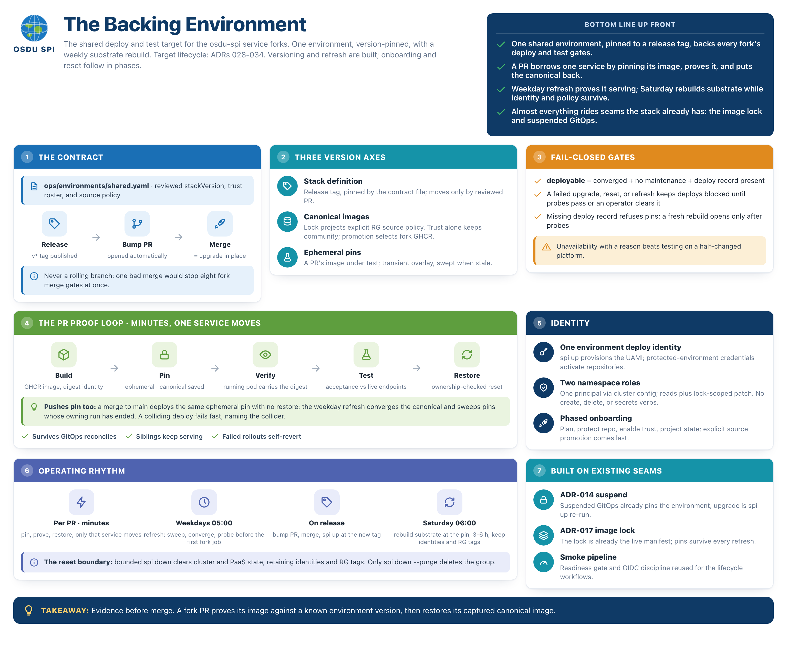

# Shared Environment Lifecycle

**What this explains.** How the shared backing environment for the
`Azure/osdu-spi-*` fork CI is versioned, refreshed, upgraded, and reset, which
workflows run those verbs, and which surfaces fork pipelines consume.

**Why it matters.** Fork deploy and test jobs depend on a standing environment
being ready when they run. When it is not, the operator needs to know which
verb applies, what it costs, and what it will not fix; improvising that during
an incident is how a 20-minute refresh becomes a 4-hour rebuild.

**Status.** `env-upgrade` and `env-refresh` are implemented and described
below as built. `env-reset` and `env-teardown`, the backstop's workflow step,
the drain, and the test-identity ensure step remain unbuilt; those sections still
describe the target mechanism ahead of the code. Remove the remaining marks
as those phases land.



## Three lifetimes

| Layer | Contents | Advances by |
|---|---|---|
| Substrate | RG `spi-stack-shared`, AKS Automatic, PaaS, Flux extension | Reset rebuilds it; an upgrade's incremental ARM pass may also move it in place (ADR-029) |
| Instance | Flux-managed workloads, `osdu-image-lock`, in-cluster middleware state | Refresh, upgrade, and fork deploys (ADR-031) |
| Version contract | `ops/environments/shared.yaml` | Reviewed PR (ADR-028) |

The environment is one deployment of the ordinary stack: `spi up --env shared
--profile core --tag <stackVersion>`. Nothing about its manifests differs from
a dev environment; what differs is that its version is pinned to a release tag
and its lifecycle runs on workflows instead of an operator's terminal.

Version is three axes, not one. The stack definition is pinned by the file
above (ADR-028). Canonical service images advance on refresh under each
service's source policy (ADR-033) and are recorded in the image lock.
Ephemeral test pins (ADR-031) are transient overlays. `spi status --json`
reports all three, the pinned-service list included; `spi service list`
details the pins.

## The pin and the bump flow

`ops/environments/shared.yaml` declares the environment:

```yaml
env: shared
stackVersion: v0.8.0
profile: core
location: westus3
ingressMode: azure
imageBranch: master
nameSuffix: a43c7
```

Publishing a release opens a `stackVersion` bump PR (a job in
`.github/workflows/release.yml` under the release App token). Merging the bump
is the reviewed moment when the environment advances; the push trigger on the
pin file starts the upgrade. Nothing else moves the stack-definition version
(ADR-028).

## Lifecycle verbs

| Verb | Workflow | Trigger | Budget |
|---|---|---|---|
| refresh | `env-refresh` | weekday cron 05:00 UTC, dispatch | 4.5 h |
| upgrade | `env-upgrade` | push to `main` touching the pin file, dispatch | 6 h |
| reset | `env-reset` | Saturday cron 06:00 UTC, confirm-dispatch | 7 h |
| teardown | `env-teardown` | protected dispatch | 1 h |

The budgets contain their worst cases: a reset spends up to 45 minutes on
deletion, 75 minutes provisioning, and 230 minutes in the cold-cluster
schema-load converge before probes; an upgrade whose `--refresh-images` pass
moves the schema image spends up to 60 minutes in `spi up` plus the same
230-minute converge, hence its 6-hour budget. A refresh is normally a
re-reconcile of already-scheduled workloads, but its wait keeps the same
230-minute allowance for a schema-load Job the standing environment re-runs,
for example after a node recycle, hence its 4.5-hour budget.

All four verbs share concurrency group `env-shared` with
`cancel-in-progress: false`, so lifecycle operations serialize against each
other; fork deploys serialize per service and are otherwise concurrent
(ADR-031). Only `refresh` and `upgrade` are implemented; `reset` and
`teardown` remain unbuilt, but reuse the same group when they land. GitHub
concurrency groups are repository-scoped, so nothing here can serialize
against fork jobs in other repositories: coordination with the fleet is the
`maintenance` flag (which stops new deploys) plus, once fork onboarding
lands, the drain (which will wait out in-flight ones; ADR-029). The
workflows run under a GitHub environment `azure-shared` on the same app
registration as the smoke pipeline, reusing its job shape: one fresh OIDC
login per job, token pre-caching, `scripts/capture_diagnostics.sh` on
failure ([ci-smoke.md](ci-smoke.md)). The sweeper cannot touch the shared
RG: it selects on the `spi-stack-ci-*` name pattern and the sweep-eligibility
tag, and the shared RG carries neither.

**Refresh** (`env-refresh.yml`, implemented) proves the environment is
serving: set the `maintenance` flag in a named quiesce step, run plain `spi
reconcile` (preserving the version-pinned source and the current image
lock; canonical images do not advance on this schedule during the
pre-onboarding phase), gate on `scripts/wait_for_flux_ready.sh` plus the
gateway probes shared with `smoke.yml` via `scripts/probe_gateway.sh`,
assert the deployed ref and source suspension are unchanged, and clear the
flag only after every check passes. A failed step leaves the flag set
(ADR-029), so a red 05:00 UTC run blocks the day's fork deploys with a
reason instead of letting them race a sick environment. The pin backstop
(sweep ephemeral pins whose owning run has ended, then `spi service refresh`
per GitHub-origin service; [fork-deployment.md](fork-deployment.md)) and the
drain insert between the quiesce step and the reconcile once fork onboarding
lands, without changing the workflow's shape.

**Upgrade** (`env-upgrade.yml`, implemented) is `spi up --env shared --tag
<new> --refresh-images` re-run on the standing environment. For an existing
environment, it is preceded by `spi connect`, the `maintenance` flag, and a
lock snapshot (`kubectl get cm osdu-image-lock -n osdu-flux -o yaml` uploaded
as a workflow artifact); a first provision skips those steps and lets `spi up
--tag` create the deploy record with maintenance already set. Both paths are
followed by the same wait, probes, and flag clear. The workflow reads the
declaration from `main` in a `declare` job, then every later job installs and
runs the `stackVersion` release wheel, which carries its own Bicep, so
the executing code and the Flux ref name the same release and the deploy
record carries the stamped CLI version (ADR-028). The source rollover is
revision-verified: resume the suspended source, reconcile, check that
`GitRepository.status.artifact.revision` names the tag's commit, suspend the
source again, then write the deploy record with maintenance still enabled
(ADR-029). The verification job separately waits for workload convergence
and clears maintenance only after its probes pass. The `--refresh-images`
pass moves canonical images during an upgrade, but the bump pins only the
stack-definition axis. Weekday refreshes preserve those canonicals until the
future fork-onboarding phase adds selective canonical refresh (ADR-033).

**Reset** (unbuilt) is teardown plus cold provision at the pinned tag: flag, drain,
snapshot the lock, `spi down`, poll until only the managed identities remain
in the group (ADR-034), then `spi up --tag <pin>` and the cold-cluster wait
with the 155-minute schema-load budget. The deploy identity and the
`spi-name-suffix` tag survive `spi down`, so the client id the forks hold
never changes, resource names and the hostname stay stable, and the Key
Vault soft-delete recovery in `spi up` finds the old vault (ADR-028). The
ensure step then reconciles the identity's federated credentials and the
service sources to the declaration's `forks:` list and repairs the
test-caller entitlements (ADR-029, ADR-032). The rebuilt environment starts
with `maintenance` set and opens to deploys only after the probes pass.

## Surfaces fork CI consumes

- `spi status --json`: `ready` for convergence, `deployable` as the
  deploy gate, a typed reason, the deployed version, and the `maintenance`
  flag. Exit 0/2/1 (ADR-030). Implemented; both lifecycle workflows gate on
  it.
- `spi info --json`: endpoints, partitions, non-secret Azure coordinates,
  the deploy identity's client id with the tenant, subscription, resource
  group, and cluster (the five values a fork holds; ADR-032), and the
  `environment` identity block (name, stack version, profile) that
  `spi status --json` publishes from the same deploy record.
  Acceptance secret names come from each service descriptor, and their values
  are fetched separately from Key Vault. In `azure` ingress mode the FQDN
  embeds the environment's name suffix; the declaration file persists the
  suffix across resets (ADR-028), so the hostname is stable, and consumers
  still re-read it per run rather than caching a value.
- `spi connect`: implemented; lifecycle jobs use it after a fresh OIDC login
  when reconnecting to an initialized deployment. `spi up` owns the cluster
  connection during provision, and the upgrade workflow uses a direct,
  short-lived AKS connection only to recognize an incomplete first provision
  that has no deploy record yet.
- `spi service pin/verify/reset` (implemented; `spi service refresh` is
  unbuilt): the fork deploy seam. The sequence and its recovery paths
  are [fork-deployment.md](fork-deployment.md); the fork-side jobs live in
  the `Azure/osdu-spi` template's workflows, not here.

## Recipes

Stand up the shared environment. This is what `env-upgrade.yml`'s
`provision` job automates; run it by hand only to reproduce or debug a
run outside CI. Install the release wheel matching `stackVersion` first: the
wheel carries the Bicep and stamps the CLI version the deploy record audits,
where a source checkout would record `0.0.0+source`. Each argument comes
from the declaration file; nothing is typed twice:

```bash
decl=ops/environments/shared.yaml
spi up \
  --env "$(yq .env $decl)" \
  --profile "$(yq .profile $decl)" \
  --location "$(yq .location $decl)" \
  --ingress-mode "$(yq .ingressMode $decl)" \
  --image-branch "$(yq .imageBranch $decl)" \
  --name-suffix "$(yq .nameSuffix $decl)" \
  --tag "$(yq .stackVersion $decl)"
bash scripts/wait_for_flux_ready.sh --timeout 13800 \
  --expect-revision "$(spi status --json | jq -r .stack.resolvedCommit)"
spi status --json | jq .ready   # true when converged
```

Drop `--ingress-mode` when the declaration's profile is `bare`: that profile
deploys no ingress substrate and `spi up` rejects the option (ADR-012).
`--expect-revision` is what makes the wait mean anything on an upgrade,
where every Kustomization is still Ready for the revision being replaced.

This recipe is provision-only: the fresh environment holds `maintenance`
(ADR-029) until the `env-refresh` workflow, or its manual dispatch, runs the
probes and clears it.

Check why the environment is not ready:

```bash
uv run spi status --json | jq -r .reason
uv run spi status          # the human view of the same collector
```

Run a manual refresh outside the cron:

```bash
gh workflow run env-refresh.yml --ref main
gh run watch
```

## Implementation roadmap

1. **Foundations** (mostly built): `spi status --json`, `spi connect`,
   chart digest rendering, digest-preserving lock overlays (ADR-030), and
   the pin surface (`pin --image --ephemeral`, `verify`, ownership-checked
   `reset`, the stale sweep; ADR-031) are implemented. Still unbuilt:
   `spi service refresh` and the two fork RBAC Roles. Exit test: hand-pin a partition GHCR digest against a
   standing environment and reset it.
2. **Versioning** (built for the backing environment): `repoTag` in
   `infra/flux.bicep`, `spi up --tag`, the deploy record, the declaration
   schema (`src/spi/environment.py`), and tri-state image refresh are
   implemented; `shared` stands up at the release tag via `env-upgrade`.
3. **Ops workflows** (mostly built): `env-refresh`, `env-upgrade`, and the
   bump-PR job are implemented. Still unbuilt: `env-reset`, `env-teardown`,
   the test-identity ensure step, and the pin backstop/drain insertion
   points noted above.
4. **Onboarding** (unbuilt): the deploy identity and two Roles in `spi up`,
   identity retention in `spi down` (ADR-034), `spi onboard`, `forks:` in
   the declaration with the ensure step; onboard `osdu-spi-partition`; the
   template-side deploy, integration-test, and restore jobs under the
   reserved check names.
5. **Canonical flips** (unbuilt): `spi onboard` records each service's
   source in the lock; on the shared environment one `forks:` line per
   service (ADR-033).

## Related ADRs

- [ADR-014: Suspend GitOps reconciliation after deploy](../decisions/014-suspend-gitops-after-deploy.md)
- [ADR-017: Per-deploy image lock](../decisions/017-osdu-image-lock.md)
- [ADR-028: Version-pinned shared backing environment](../decisions/028-version-pinned-shared-environment.md)
- [ADR-029: Environment lifecycle verbs and the reset boundary](../decisions/029-environment-lifecycle-and-reset-boundary.md)
- [ADR-030: Machine-readable status and the deploy record](../decisions/030-machine-readable-status-contract.md)
- [ADR-031: Fork-built images deploy as ephemeral lock pins](../decisions/031-fork-image-deploys-as-ephemeral-pins.md)
- [ADR-032: Environment deploy identity and namespace RBAC](../decisions/032-per-fork-deploy-identity.md)
- [ADR-033: Canonical image source follows onboarding](../decisions/033-canonical-image-source-follows-onboarding.md)
- [ADR-034: Managed identities survive `spi down`](../decisions/034-deploy-identity-survives-down.md)

## Source files

- `ops/environments/shared.yaml`, `ops/environments/README.md`
- `src/spi/environment.py`, `src/spi/deploy_record.py`
- `infra/flux.bicep`
- `src/spi/cli.py`, `src/spi/deploy.py`, `src/spi/status.py`,
  `src/spi/pins.py`, `src/spi/images.py`
- `.github/workflows/release.yml`, `.github/workflows/smoke.yml`,
  `.github/workflows/env-upgrade.yml`, `.github/workflows/env-refresh.yml`
- `scripts/export_environment.py`, `scripts/wait_for_flux_ready.sh`,
  `scripts/probe_gateway.sh`, `scripts/capture_diagnostics.sh`
- `.release-please-config.json`, `docs/tag-ruleset.json`
