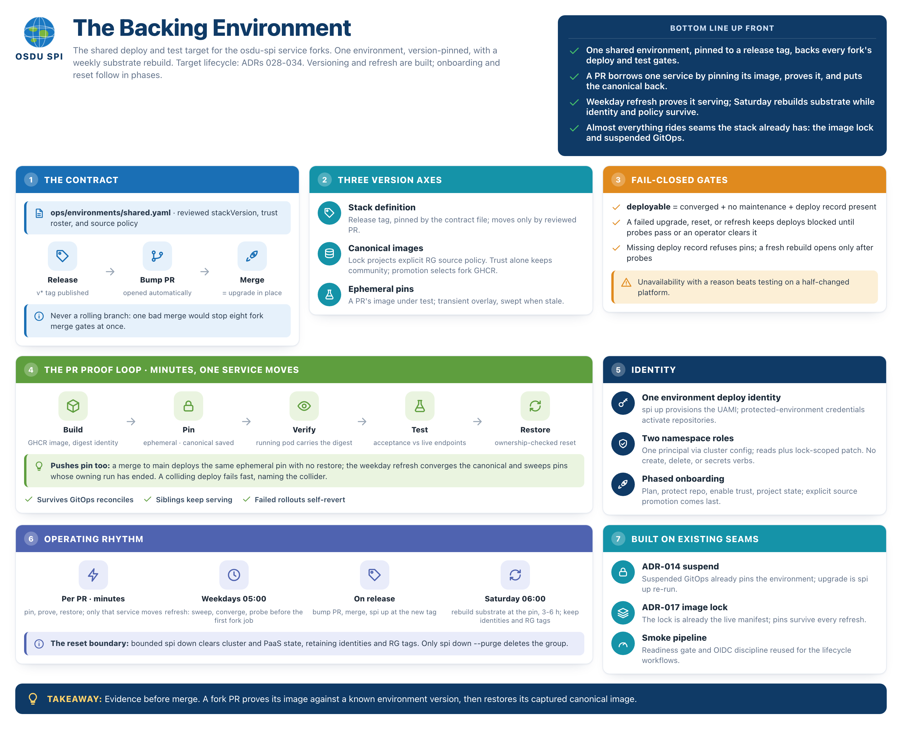

# Shared Environment Lifecycle

**What this explains.** How the shared backing environment for the
`Azure/osdu-spi-*` fork CI is versioned, refreshed, upgraded, and reset, which
workflows run those verbs, and which surfaces fork pipelines consume.

**Why it matters.** Fork deploy and test jobs depend on a standing environment
being ready when they run. When it is not, the operator needs to know which
verb applies, what it costs, and what it will not fix; improvising that during
an incident is how a 20-minute refresh becomes a 4-hour rebuild.

**Status.** `env-upgrade` and `env-refresh` are implemented and described
below as built, as is the test-identity ensure step. Onboarding-intent
reconciliation is implemented in the CLI and both workflows, and `shared`'s
declaration lists the five repositories it trusts. `env-reset` and `env-teardown`,
the stale-pin sweep's workflow step, and the drain remain unbuilt; those
sections still describe the target mechanism ahead of the code. Remove the remaining marks
as those phases land.



## Four lifetimes

| Layer | Contents | Advances by |
|---|---|---|
| Environment identity | RG `spi-stack-shared`, managed identities and credentials, external DNS grants, suffix and source-policy tags, declaration locator | Onboarding and declaration reconciliation change intent; purge removes external grants before deleting the group (ADR-034) |
| Substrate | AKS Automatic, PaaS, Flux extension | Reset rebuilds it; an upgrade's incremental ARM pass may also move it in place (ADR-029) |
| Instance | Flux-managed workloads, `osdu-image-lock`, in-cluster middleware state | Refresh, upgrade, and fork deploys (ADR-031) |
| Version contract | `ops/environments/shared.yaml` | Reviewed PR (ADR-028) |

The environment is one deployment of the ordinary stack: `spi up --env shared
--profile core --tag <stackVersion>`. Nothing about its manifests differs from
a dev environment; what differs is that its version is pinned to a release tag
and its lifecycle runs on workflows instead of an operator's terminal.

Version is three axes, not one. The stack definition is pinned by the file
above (ADR-028). Canonical service images advance on refresh under each
service's source policy (ADR-033) and are recorded in the image lock.
Ephemeral test pins (ADR-031) are transient overlays. `spi status --json`
reports the running stack version under `environment.running`, the lock's
branch and resolve time, and the pins; `spi info --json` adds each service's
image under `osdu_versions`, and `spi service list` details the pins.

## The pin and the bump flow

`ops/environments/shared.yaml` declares the environment:

```yaml
env: shared
stackVersion: v0.18.0
profile: core
location: westus3
ingressMode: azure
imageBranch: master
nameSuffix: a43c7
```

Publishing a release opens a `stackVersion` bump PR (a job in
`.github/workflows/release.yml` under the release App token). Merging the bump
is the reviewed moment when the environment advances; the push trigger on the
pin file starts the upgrade. Nothing else moves the stack-definition version
(ADR-028).

## Lifecycle verbs

| Verb | Workflow | Trigger | Budget |
|---|---|---|---|
| refresh | `env-refresh` | weekday cron 04:00 UTC, dispatch | 5 h |
| upgrade | `env-upgrade` | push to `main` touching the pin file, dispatch | 6.5 h |
| reset | `env-reset` | Saturday cron 06:00 UTC, confirm-dispatch | 7 h |
| teardown | `env-teardown` | protected dispatch | 1 h |

The budgets contain their worst cases: a reset spends up to 45 minutes on
deletion, 75 minutes provisioning, and 230 minutes in the cold-cluster
schema-load converge before probes; an upgrade whose `--refresh-images` pass
moves the schema image spends up to 60 minutes in `spi up` plus the same
230-minute converge, hence its 6.5-hour budget. A refresh is normally a
re-reconcile of already-scheduled workloads, but its wait keeps the same
230-minute allowance for a schema-load Job the standing environment re-runs,
for example after a node recycle, hence its 5-hour budget. The fork
canonical refresh ahead of that wait is capped at 20 minutes; it waits on
Flux only for a service whose image moved, and a rollout still running at
the cap fails the run. Both verbs end with `spi load` for the registry's
default loads (ADR-040), after maintenance clears and capped at 30 minutes: a
first reference-data load took 7 minutes on a core environment and a complete
load returns at once. A failed load fails the run and leaves the environment
deployable.

All four verbs share concurrency group `env-shared` with
`cancel-in-progress: false`, so lifecycle operations serialize against each
other; fork deploys serialize per service and are otherwise concurrent
(ADR-031). Only `refresh` and `upgrade` are implemented; `reset` and
`teardown` remain unbuilt, but reuse the same group when they land. GitHub
concurrency groups are repository-scoped, so nothing here can serialize
against fork jobs in other repositories: coordination with the fleet is the
`maintenance` flag (which stops new deploys) plus, once fork onboarding
lands, the drain (which will wait out in-flight ones; ADR-029). The
workflows run under a GitHub environment `azure-shared` on the same app
registration as the smoke pipeline, reusing its job shape: one fresh OIDC
login per job, token pre-caching, `scripts/capture_diagnostics.sh` on
failure ([ci-smoke.md](ci-smoke.md)). The sweeper cannot touch the shared
RG: it selects on the `spi-stack-ci-*` name pattern and the sweep-eligibility
tag, and the shared RG carries neither.

**Refresh** (`env-refresh.yml`, implemented) proves the environment is
serving: set the `maintenance` flag in a named quiesce step, run plain `spi
reconcile` (preserving the version-pinned source and the current image
lock), run `spi onboard --reconcile --write` to restore declared fork trust
and source policy, run `spi service refresh --forks` to advance fork-sourced
canonicals (ADR-033), gate on `scripts/wait_for_flux_ready.sh` plus the gateway probes
shared with `smoke.yml` via `scripts/probe_gateway.sh`, assert the deployed
ref and source suspension are unchanged, and clear the flag only after every
check passes. Community-sourced canonicals do not advance on this schedule.
The fork refresh runs when the declared `stackVersion` is v0.22.0 or later,
and the reconcile when it is v0.24.0 or later; an older declaration logs a
notice and skips the step. The reconcile is capped at 5 minutes and changes
nothing on an environment whose resource group records no declaration. The schedule starts
an hour before the fork template's retention job (Mondays 05:00 UTC), so a
canonical moves to a fork's weekend build before retention deletes the image
that build replaced. A failed step leaves the flag set (ADR-029), so a red
04:00 UTC run blocks the day's fork deploys with a reason instead of letting
them race a sick environment. The stale-pin sweep
([fork-deployment.md](fork-deployment.md)) and the drain insert between the
quiesce step and the reconcile, without changing the workflow's shape; both
steps are unbuilt.

**Upgrade** (`env-upgrade.yml`, implemented) is `spi up --env shared --tag
<new> --refresh-images` re-run on the standing environment. For an existing
environment, it is preceded by `spi connect`, the `maintenance` flag, and a
lock snapshot (`kubectl get cm osdu-image-lock -n osdu-flux -o yaml` uploaded
as a workflow artifact); a first provision skips those steps and lets `spi up
--tag` create the deploy record with maintenance already set. Both paths are
followed by the same wait, probes, and flag clear. The workflow reads the
declaration from `main` in a `declare` job, then every later job installs and
runs the `stackVersion` release wheel, which carries its own Bicep, so
the executing code and the Flux ref name the same release and the deploy
record carries the stamped CLI version (ADR-028). The source rollover is
revision-verified: resume the suspended source, reconcile, check that
`GitRepository.status.artifact.revision` names the tag's commit, suspend the
source again, then write the deploy record with maintenance still enabled
(ADR-029). The verification job separately waits for workload convergence
and clears maintenance only after its probes pass. The `--refresh-images`
pass moves canonical images during an upgrade, but the bump pins only the
stack-definition axis. Weekday refreshes preserve community canonicals and
advance fork-sourced ones (ADR-033).

**Onboarding intent** is loaded from the reviewed declaration before the
refresh or upgrade workflow resolves an image; `spi service refresh` and
`spi reconcile --refresh-images` run by hand read the lock's projections as
the last reconcile left them. `forks:` owns trust and
`canonicalSource`; retained credentials and `spi-source-<service>` tags
cannot override it. First declared provision takes
`spi up --declaration <owner>/<repo>:<path>`. The CLI reads that file on
`main`, takes its provisioning fields and fork intent, and rejects
conflicting explicit flags before provisioning or image resolution. It
persists the locator in the RG's `spi-environment-declaration` tag when the
group is created, or on the next run against a group that lacks it. With an
existing locator, an omitted option reuses it and a conflicting locator is
refused.

`env-upgrade.yml` carries the locator through the jobs that already carry
the declaration's individual fields:

| Surface | Wiring |
|---|---|
| `declare` job | Exports `declares_forks`, true when the file lists at least one fork, beside the validated fields read from `main`. |
| `provision` job | Appends `--declaration "${GITHUB_REPOSITORY}:${DECLARATION_PATH}"` to the `spi up` argument array when `declares_forks` is true and `stackVersion` is v0.24.0 or later; an older version logs a notice and provisions undeclared. |
| Reset workflow (unbuilt) | Use the same declaration input for re-provisioning; the retained locator must agree rather than supplying competing intent. |

The `declares_forks` gate exists because a declaration with no forks revokes
every fork credential on the identities. `shared` trusts repositories that
`spi onboard` added by hand, so handing over the file before it lists them
would remove them at the next upgrade. Once the locator is retained, every
later `spi up` and refresh reconciles to the file whether or not the
workflow passes it, including down to an empty list.

Reconciliation runs in one order wherever it runs
(`src/spi/declared.py`): record `community` for undeclared sources, revoke
undeclared and stale credentials, write declared credentials, record
declared sources, then rebuild the lock's trust and source projections. The ensure path checks
repository protection before enabling a credential and serializes credential
writes per identity. `spi up` plans that reconciliation twice. The first
pass runs before the resource group is touched, against identities that may
not exist yet, and stops the run when a declared fork cannot be trusted or
its image cannot resolve; images then resolve from the declared sources, not
from retained tags. The second pass applies the writes at bootstrap, after
the identities exist and before the projections are rebuilt. It is not a
post-provision step that first corrects an obsolete image source.
`env-refresh` runs the same reconciliation on the standing cluster as
`spi onboard --reconcile --write`, ahead of the fork refresh that reads the
projections.

**Reset** (unbuilt) is deletion plus cold provision at the pinned tag: load and
validate the declaration, flag, drain, snapshot the lock, then `spi down`.
`spi down` itself is built: it has a 45-minute deadline and reports success
only after the group contains identities alone and the managed nodes group
is gone (ADR-034).
A failed or timed-out delete stops reset; a re-run resumes from the reported
remaining inventory. Only after completion does `spi up --tag <pin>` resolve
the declaration's desired sources and start the cold provision and converge
wait. The retained roster is not used as a substitute for that declaration.

The deploy identity, suffix, source-policy tags, and declaration locator
survive deletion, so repository client IDs and resource names stay stable,
and Key Vault recovery finds the old vault (ADR-028). Bootstrap reconciles
credentials and source projections; the ensure step repairs test-caller
entitlements: `spi up` and `spi reconcile` write the deploy identity's client
id into `spi-init-values`, and the `entitlements-members` Job in the
non-gating `spi-osdu-members` Kustomization adds it to the four root groups
of every partition, reporting through `entitlements_seeded` in
`spi info --json`. A Job name carries a hash of the member list, so a
recreated identity renders a new Job and an unchanged one is left Complete.
A failed Job is the `bootstrap_failed` blocker in `spi status --json`
(ADR-030), and the current Job not yet Complete is `bootstrap_pending`,
so a reconcile that adds or changes the seed closes the gate until it
lands; a failure's message carries the script's outcome line from the pod
termination message, naming the member and group that failed. The rebuilt environment starts with `maintenance`
set and opens to deploys only after the probes pass. Protected teardown uses
`spi down --purge`, which discovers external grants from the retained
principal IDs and removes the stack-owned ExternalDNS zone assignment before
deleting the group. An unreadable inventory, unrecognized grant, or failed
removal leaves the identities and group standing (ADR-034).

## Surfaces fork CI consumes

- `spi status --json`: `ready` for convergence, `deployable` as the
  deploy gate, a typed reason, the deployed version, and the `maintenance`
  flag. Exit 0/2/1 (ADR-030). Implemented; both lifecycle workflows gate on
  it.
- `spi info --json`: endpoints, partitions, non-secret Azure coordinates,
  the deploy identity's client id with the tenant, subscription, resource
  group, and cluster (the five values a fork holds; ADR-032), and the
  `environment` identity block (name, stack version, profile) that
  `spi status --json` publishes from the same deploy record. Its `loads`
  block names each load in the environment's registry with a state, source,
  and per-partition record counts (ADR-040); the fork deploy identity reads
  it and cannot start a load.
  Acceptance secret names come from each service descriptor, and their values
  are fetched separately from Key Vault. In `azure` ingress mode the FQDN
  embeds the environment's name suffix; the declaration file persists the
  suffix across resets (ADR-028), so the hostname is stable, and consumers
  still re-read it per run rather than caching a value.
- `spi connect`: implemented; lifecycle jobs use it after a fresh OIDC login
  when reconnecting to an initialized deployment. `spi up` owns the cluster
  connection during provision, and the upgrade workflow uses a direct,
  short-lived AKS connection only to recognize an incomplete first provision
  that has no deploy record yet.
- `spi service pin/verify/reset/refresh` (implemented): the fork deploy
  seam. The sequence and its recovery paths
  are [fork-deployment.md](fork-deployment.md); the fork-side jobs live in
  the `Azure/osdu-spi` template's workflows, not here.

## Recipes

Stand up the shared environment. This is what `env-upgrade.yml`'s
`provision` job automates; run it by hand only to reproduce or debug a
run outside CI. Install the release wheel matching `stackVersion` first: the
wheel carries the Bicep and stamps the CLI version the deploy record audits,
where a source checkout would record `0.0.0+source`. Each argument comes
from the declaration file; nothing is typed twice:

```bash
decl=ops/environments/shared.yaml
spi up \
  --env "$(yq .env $decl)" \
  --profile "$(yq .profile $decl)" \
  --location "$(yq .location $decl)" \
  --ingress-mode "$(yq .ingressMode $decl)" \
  --image-branch "$(yq .imageBranch $decl)" \
  --name-suffix "$(yq .nameSuffix $decl)" \
  --tag "$(yq .stackVersion $decl)"
bash scripts/wait_for_flux_ready.sh --timeout 13800 \
  --expect-revision "$(spi status --json | jq -r .environment.resolvedCommit)"
spi status --json | jq .ready   # true when converged
```

Drop `--ingress-mode` when the declaration's profile is `bare`: that profile
deploys no ingress substrate and `spi up` rejects the option (ADR-012).
`--expect-revision` is what makes the wait mean anything on an upgrade,
where every Kustomization is still Ready for the revision being replaced.

This recipe is provision-only: the fresh environment holds `maintenance`
(ADR-029) until the `env-refresh` workflow, or its manual dispatch, runs the
probes and clears it. Once the declaration lists forks, the same provision is
`spi up --env shared --declaration
Azure/osdu-spi-stack:ops/environments/shared.yaml --refresh-images` on a
v0.24.0 or later wheel: the file supplies every option above, and repeating
one with a different value is refused.

Check why the environment is not ready:

```bash
uv run spi status --json | jq -r .reason
uv run spi status          # the human view of the same collector
```

Run a manual refresh outside the cron:

```bash
gh workflow run env-refresh.yml --ref main
gh run watch
```

## Implementation roadmap

1. **Foundations** (mostly built): `spi status --json`, `spi connect`,
   chart digest rendering, digest-preserving lock overlays (ADR-030), and
   the pin surface (`pin --image --ephemeral`, `verify`, ownership-checked
   `reset`, the stale sweep; ADR-031) and `spi service refresh` are
   implemented. Exit test: hand-pin a partition GHCR digest against a
   standing environment and reset it.
2. **Versioning** (built for the backing environment): `repoTag` in
   `infra/flux.bicep`, `spi up --tag`, the deploy record, the declaration
   schema (`src/spi/environment.py`), and tri-state image refresh are
   implemented; `shared` stands up at the release tag via `env-upgrade`.
3. **Ops workflows** (mostly built): `env-refresh`, `env-upgrade`, and the
   bump-PR job are implemented, as is the test-identity ensure step. Still
   unbuilt: `env-reset`, `env-teardown`, and the stale-pin sweep and drain
   steps noted above.
4. **Onboarding** (in progress): the deploy identity and two Roles in `spi up`,
   identity and RG-tag retention in `spi down` (ADR-034), and the trust path
   of `spi onboard` (repository protection, the five values, the federated
   credential, the roster projection with roster-derived pin validation) and
   `--canonical-source` with its source-policy phase are built, as are
   `forks:`, the declaration locator with pre-resolution intent loading, and
   `spi onboard --reconcile`. `ops/environments/shared.yaml` lists the
   repositories `shared` trusts, each on a community canonical. The template
   implements one `deploy-test` job with borrow, prove, and restore steps;
   `validation-summary` reports its result through the required summary check.
   See [fork deployment](fork-deployment.md#the-sequence).
5. **Canonical promotions** (partly built): explicit per-service source
   policy in RG tags and its lock projection are implemented, as is the
   weekday `spi service refresh --forks` that advances fork-sourced
   canonicals inside the retention window. Still unbuilt: on the shared
   environment, a reviewed `canonicalSource: fork` change after the deploy
   and test gates pass (ADR-033).

## Related ADRs

- [ADR-014: Suspend GitOps reconciliation after deploy](../decisions/014-suspend-gitops-after-deploy.md)
- [ADR-017: Per-deploy image lock](../decisions/017-osdu-image-lock.md)
- [ADR-028: Version-pinned shared backing environment](../decisions/028-version-pinned-shared-environment.md)
- [ADR-029: Environment lifecycle verbs and the reset boundary](../decisions/029-environment-lifecycle-and-reset-boundary.md)
- [ADR-030: Machine-readable status and the deploy record](../decisions/030-machine-readable-status-contract.md)
- [ADR-031: Fork-built images deploy as ephemeral lock pins](../decisions/031-fork-image-deploys-as-ephemeral-pins.md)
- [ADR-032: Environment deploy identity and namespace RBAC](../decisions/032-environment-deploy-identity.md)
- [ADR-033: Canonical image source follows onboarding](../decisions/033-explicit-canonical-image-source-policy.md)
- [ADR-034: Managed identities survive `spi down`](../decisions/034-deploy-identity-survives-down.md)

## Source files

- `ops/environments/shared.yaml`, `ops/environments/README.md`
- `src/spi/environment.py`, `src/spi/deploy_record.py`
- `infra/flux.bicep`
- `src/spi/cli.py`, `src/spi/deploy.py`, `src/spi/status.py`,
  `src/spi/pins.py`, `src/spi/images.py`
- `.github/workflows/release.yml`, `.github/workflows/smoke.yml`,
  `.github/workflows/env-upgrade.yml`, `.github/workflows/env-refresh.yml`
- `scripts/export_environment.py`, `scripts/wait_for_flux_ready.sh`,
  `scripts/probe_gateway.sh`, `scripts/capture_diagnostics.sh`
- `.release-please-config.json`, `docs/tag-ruleset.json`
