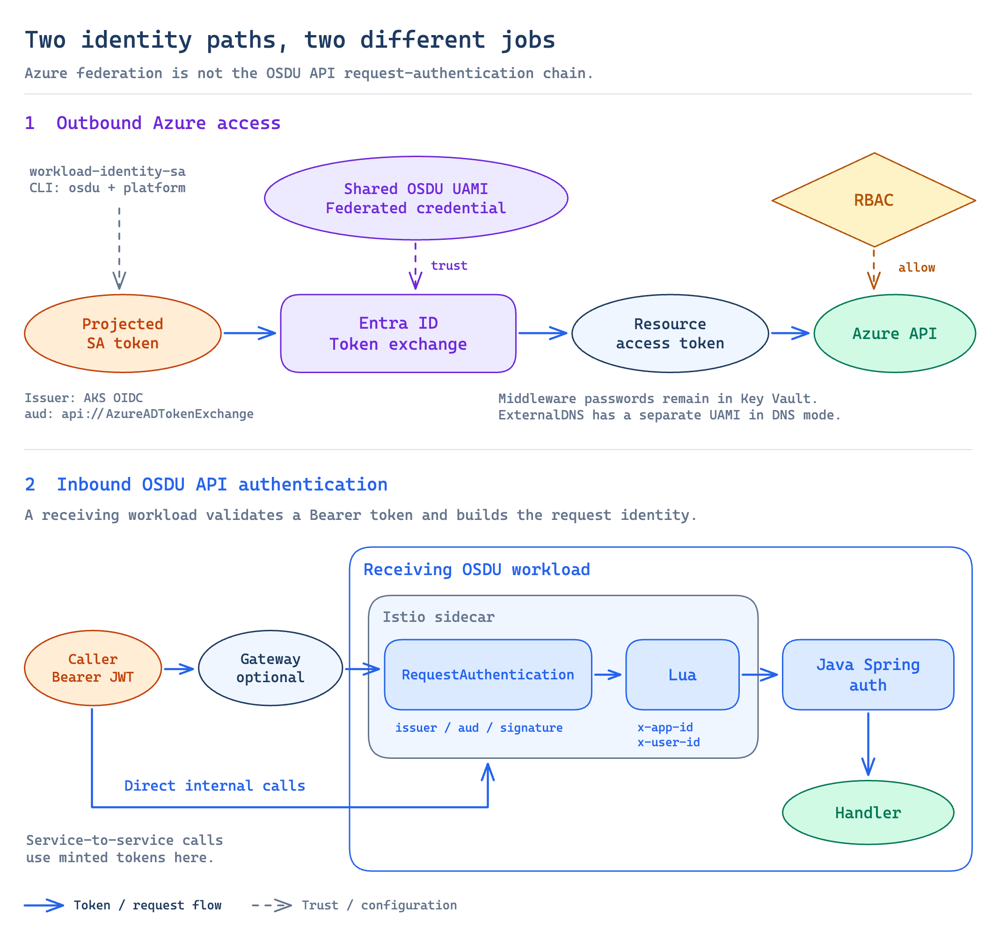

# Workload Identity and request authentication

There are two identity paths in SPI Stack. A workload uses **Workload Identity
to obtain an Azure access token**. An OSDU service uses **Istio JWT validation
and header projection to identify an incoming API caller**. A successful token
exchange does not prove that an OSDU request will be accepted.



## Calling Azure from a pod

The OSDU workloads share a user-assigned managed identity (UAMI), named
`spi-stack-<env>-osdu-identity`. Its federated credentials bind Kubernetes
ServiceAccount subjects to the AKS OpenID Connect (OIDC) issuer.

The exchange works as follows:

1. The CLI creates `workload-identity-sa` in `osdu` and `platform`, annotated
   with the UAMI client ID and tenant ID.
2. A pod uses that ServiceAccount and opts in with
   `azure.workload.identity/use: "true"`.
3. The AKS Workload Identity webhook mounts a projected ServiceAccount token
   and injects the client, tenant, and token-file settings.
4. The Azure SDK exchanges that token with Entra ID for an access token for
   the requested resource. The federated credential must match the issuer,
   subject, and token-exchange audience.
5. The Azure resource authorizes the resulting identity according to its
   access configuration.

The projected token is a file mounted in the pod, not a stored client secret.
Its audience, `api://AzureADTokenExchange`, is distinct from the audience of the
Azure access token returned by Entra ID.

`identity.bicep` currently declares federated bindings for `osdu` and `platform`
plus additional namespaces retained in its default list. Bootstrap does not
create ServiceAccounts in all of those namespaces. The module's
`federatedNamespaces` parameter is the authoritative binding list.

## Access and isolation

The shared UAMI receives Key Vault Secrets User, Storage Blob Data Contributor,
Service Bus Data Sender/Receiver, and AcrPull assignments. The current RBAC
module grants Storage Table Data Contributor on common Storage; its
per-partition Storage assignments are for blobs.

Cosmos SQL and Gremlin Data Contributor grants are Cosmos-native assignments,
declared in the partition and Gremlin modules. They do not appear in
`az role assignment` output. The kubelet identity receives a separate AcrPull
grant because container pulls do not use the pod's Workload Identity.

These assignments simplify provisioning, but do not isolate one OSDU service's
Azure access from another's. The cluster control-plane identity used for
networking is separate. In `dns` mode, ExternalDNS also gets a separate identity,
federated to its `foundation/external-dns` ServiceAccount and granted DNS access.

Cosmos and Service Bus disable local authentication; Storage disables
shared-key access. Key and connection-string entries retained for partition
compatibility contain `DISABLED`, not usable credentials. Images whose clients
still require keys or SAS cannot operate against that data plane. The
infrastructure does not add a fallback for them: it requires
Workload-Identity-capable images ([ADR-023](../decisions/023-entra-only-data-plane.md)).

Middleware passwords and Airflow signing material remain stored in Kubernetes
Secrets and Key Vault. [Secret lifecycle](secret-lifecycle.md) describes those
values separately from Azure token exchange.

## Environment deploy identity

`spi up` also provisions `spi-stack-<env>-deployer`, separate from the OSDU
workload identity and the signed-in principal running bootstrap. It receives
AKS Cluster User and Key Vault Secrets User roles. The core profile deploys
`spi-fork-deployer` in `osdu-flux` and `spi-fork-verifier` in `osdu`; their
RoleBindings use its principal ID from `spi-cluster-config`.

Those Roles permit image-lock patches and workload reads, without granting
Kubernetes Secret access or writes to the deploy record and maintenance flag.
A trusted writer can patch the whole lock, so this does not isolate one
service's image keys from another's. Initial provisioning adds no repository
federated credential. `spi onboard` plans trust activation, and `--write`
applies repository protection, the five connection values, federation, and the
lock's trusted-repository projection. `spi up` rebuilds that projection from
retained identity credentials. Canonical-source promotion and declaration
enforcement remain unbuilt. `spi info --json` publishes the deploy client ID. See [ADR-032](../decisions/032-environment-deploy-identity.md)
and [fork deployment](fork-deployment.md) for the access contract.

Ordinary `spi down` retains these managed identities; `--purge` removes them
after external-grant cleanup ([ADR-034](../decisions/034-deploy-identity-survives-down.md)).

## Receiving an OSDU API request

External callers reach OSDU through the gateway. Internal callers can reach
services directly. In both cases, the receiving service's Istio sidecar applies
the identity policies before the request reaches the Java service.

The CLI renders these resources from `templates.py` and applies them in `osdu`:

| Resource | Responsibility |
|---|---|
| `RequestAuthentication/spi-osdu-jwt-authn` | Validate a supplied JWT against the configured Entra issuers and audiences; forward the original token and expose its payload |
| `EnvoyFilter/spi-osdu-identity-filter` | Read validated JWT metadata and populate `x-app-id` and `x-user-id` for the Azure-provider Spring filters |
| `PeerAuthentication/spi-osdu-mtls` | Set mesh peer authentication to `PERMISSIVE`, including for bootstrap traffic |

JWT validation, mesh mTLS, and application authorization are separate checks.
For example, `RequestAuthentication` does not by itself require every request
to contain a token. Do not interpret the presence of that resource as a complete
authorization policy.

The Lua filter removes incoming identity headers before projecting its own.
Its mapping uses the token audience for `x-app-id` and issuer-specific claims
for `x-user-id`. Management-audience bootstrap tokens have a special mapping
to the OSDU UAMI client ID. The exact claim handling is in
[`istio_auth_resources()`](../../src/spi/templates.py), not in the federation
module.

## Audiences used by OSDU callers

Bootstrap Jobs obtain management-scoped tokens. Service-to-service code uses
the configured OSDU application ID as its token scope.

| Token path | Configuration |
|---|---|
| Bootstrap Jobs | Management audience, accepted by the template's Entra v1 issuer rule with or without a trailing slash |
| OSDU service-to-service calls | `${aadClientId}/.default` scope; application audience accepted by the v1 and v2 issuer rules |

`AAD_CLIENT_ID` defaults to the OSDU UAMI client ID. An environment-variable
override can select a separate OSDU app registration. `deploy.py` passes that
same value to both `osdu-config` and the Istio policy template, which includes
it as an additional audience when it differs from the UAMI ID.

The application ID is not the identity's principal/object ID. Changing an
audience in the Istio policy also does not grant Azure permissions or establish
the app registration needed to obtain that token.

## Locating an authentication failure

First identify the failing boundary. A 401 or 403 alone does not tell you
whether token acquisition, JWT validation, or application authorization failed.

| Failure boundary | Inspect |
|---|---|
| SDK cannot acquire a token | Pod ServiceAccount and opt-in label; injected token-file settings; matching UAMI federation issuer and subject |
| Azure resource rejects a token | Requested resource/audience, identity principal, resource role assignments and propagation |
| Sidecar rejects an OSDU request | JWT issuer/audience and the deployed RequestAuthentication |
| Java service sees missing or unexpected identity | JWT validation outcome, deployed EnvoyFilter, its metadata-to-header mapping |
| Identity is present but API access is denied | Service authorization, partition configuration, and entitlements |

Start with configuration and conditions, without printing tokens:

```bash
kubectl get serviceaccount workload-identity-sa -n osdu -o yaml
kubectl get deployment osdu-partition -n osdu -o yaml
kubectl get requestauthentication spi-osdu-jwt-authn -n osdu -o yaml
kubectl get envoyfilter spi-osdu-identity-filter -n osdu -o yaml
kubectl logs deployment/osdu-partition -n osdu -c osdu-partition --tail=50
```

Inspect proxy logs as needed, but do not assume default proxy logging emits a
line for every successful JWT validation. Do not paste bearer tokens or decoded
payloads containing user data into issues.

For Cosmos, inspect native SQL or Gremlin role assignments as well as the
identity. A successful ARM role grant is not evidence that a Cosmos data-plane
grant exists or has propagated.

## Decisions and implementation

- [ADR-005](../decisions/005-workload-identity.md): shared workload identity.
- [ADR-023](../decisions/023-entra-only-data-plane.md): disabled key/SAS authentication and image-compatibility constraint.
- [ADR-016](../decisions/016-istio-jwt-projection.md): incoming request identity projection.
- [Identity module](../../infra/modules/identity.bicep) and [RBAC module](../../infra/modules/rbac.bicep): federation and grants.
- [ExternalDNS identity](../../infra/modules/external-dns-identity.bicep): separate DNS federation.
- [Templates](../../src/spi/templates.py): ServiceAccount and Istio resources.
- [Deployment](../../src/spi/deploy.py): shared application-ID resolution and policy application.
- [Onboarding](../../src/spi/onboard.py): protected-repository trust and lock projection.
- [Service chart](../../software/charts/osdu-spi-service/templates/deployment.yaml): pod identity opt-in.
